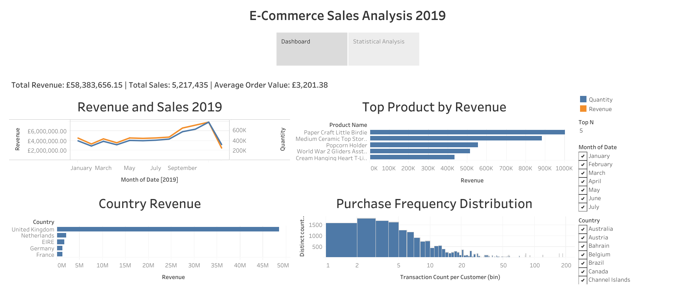

# E-Commerce Sales Performance Analysis

This project analyzes e-commerce sales data to identify revenue drivers, product performance, and customer purchasing patterns.

## Analysis Workflow

* Data Cleaning (Python)
* Exploratory Data Analysis
* Statistical Testing
* Dashboard Visualization

## Key Insights

* Revenue trends across time periods
* Top performing product categories
* Customer purchasing behavior

# Dashboard

https://public.tableau.com/views/Milestone2Dashboard_17700270972680/E-CommerceSalesAnalysis

## Tools

Python, Pandas, Matplotlib, SciPy, Tableau